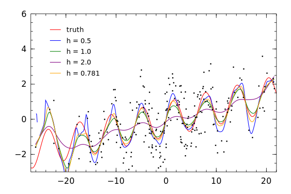

# KernSmooth

[](https://travis-ci.org/lendle/KernSmooth.jl)

## About

KernSmooth.jl is the start of a direct port of the R package [KernSmooth](http://cran.r-project.org/web/packages/KernSmooth/index.html), (v2.23-10.)
The R package carries an unlimited license.

Currently the `locpoly` function is implemented, which uses local polynomials to estimate pdf of a single variable or a regression function for two variables, or their derivatives.

## Usage

### `locpoly`

The method signatures:
```julia
locpoly(x::Vector{Float64}, y::Vector{Float64}, bandwidth::Union(Float64, Vector{Float64});
    drv::Int = 0,
    degree::Int=drv+1,
    kernel::Symbol = :normal,
    gridsize::Int = 401,
    bwdisc::Int = 25,
    range_x::Vector{Float64}=Float64[],
    binned::Bool = false,
    truncate::Bool = true)

locpoly(x::Vector{Float64}, bandwidth::Union(Float64, Vector{Float64}); args...)
```

* `x` - vector of x data
* `y` - vector of y data. For density estimation (of `x`), `y` should be omitted or be an empty `Vector{T}`
* `bandwidth` - should be a scalar or vector of length `gridsize`
* Other arguments are optional. For their descriptions, see the [R documentation](https://stat.ethz.ch/R-manual/R-devel/library/KernSmooth/html/locpoly.html)

A `(Vector{Float64}, Vector{Float64})` is returned.  The first vector is the sorted set of points at which an estimate was computed. The estimates are in the second vector.

#### Regression example

```julia
using KernSmooth
X = randn(250) * 10
Y = sin(X) + X ./15.0 + randn(250)

#estimate E(Y|X)
xgrid, yhat = locpoly(X, Y, 1.0)

#plot results with Winston
using Winston

xgrid, yhat = locpoly(X, Y, 1.0)
ytrue = sin(xgrid) + xgrid ./15.0

p = FramedPlot(xrange=(-30, 30), yrange = (-4,4))
t = Curve(xgrid, ytrue, color="red")
setattr(t, label="truth")
f = Curve(xgrid, yhat, color="blue")
setattr(f, label="fit")
s = Points(X, Y, kind = "dot")
l = Legend(.1, .9, {t,f})
add(p, t, f, s, l)
```
<!-- file("scatter.png", height=400, width=600) -->



